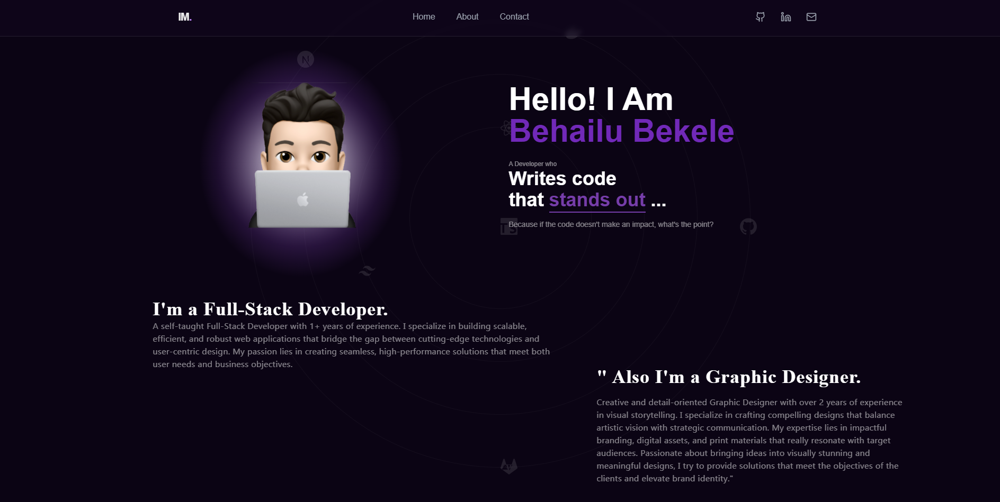
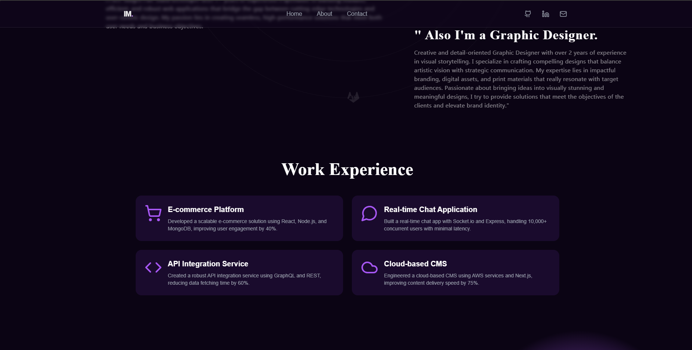
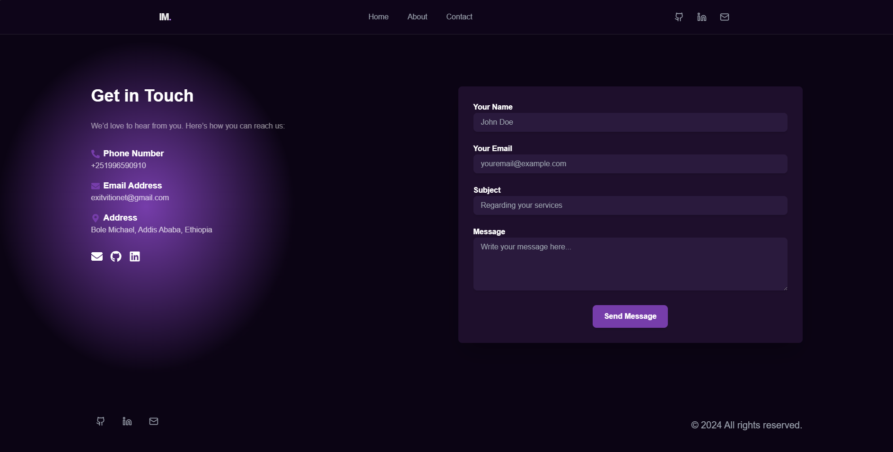

# My Portfolio

Welcome to my personal portfolio website! This site showcases my web development skills, projects, and experiences. It is built with **Next.js**, **Tailwind CSS**, and **React**, providing a responsive, fast, and modern design.

## Table of Contents

- [Overview](#overview)
- [Installation](#installation)
- [Usage](#usage)
- [Technologies Used](#technologies-used)
- [Features](#features)
- [Screenshots](#screenshots)
- [Contributing](#contributing)
- [License](#license)

## Overview

This portfolio website demonstrates my ability to build dynamic web applications. It features a clean and minimalistic design with smooth transitions and animations. I have included some of my past work, skills, and a contact section for potential clients or collaborators to reach out.

### Key Features:

- **Responsive Design**: Optimized for all device sizes (mobile, tablet, desktop).
- **Smooth Transitions**: Seamless page navigation with Next.js routing.
- **Performance Optimized**: Built with Next.js's server-side rendering for fast loading.
- **Modern UI**: Minimalistic design using Tailwind CSS for styling.

## Installation

To get started with this portfolio locally, follow these steps:

1. **Clone the repository**:
    ```bash
    git clone https://github.com/nahomtechet/My-profile.git
    ```

2. **Navigate into the project directory**:
    ```bash
    cd portfolio
    ```

3. **Install dependencies**:
    Using npm:
    ```bash
    npm install
    ```
    Or, using Yarn:
    ```bash
    yarn install
    ```

## Usage

Once the dependencies are installed, you can run the project locally:

1. **Start the development server**:
    Using npm:
    ```bash
    npm run dev
    ```
    Or, using Yarn:
    ```bash
    yarn dev
    ```

2. **Open your browser** and go to [http://localhost:3000](http://localhost:3000) to view the website.

## Technologies Used

This portfolio is built using the following technologies:

- **Next.js**: A React framework for building server-side rendered and static web applications.
- **Tailwind CSS**: A utility-first CSS framework for building modern, responsive web UIs.
- **React**: A JavaScript library for building user interfaces with components.
- **Node.js**: A JavaScript runtime for building the server-side application.

## Features

### 1. **Responsive Design**
The website is fully responsive, ensuring a smooth experience on all devices, from mobile phones to desktop monitors.

### 2. **Client-Side Routing**
Built with Next.js, the site includes seamless client-side routing, meaning that navigation between sections does not require a page reload.

### 3. **Smooth Animations**
Page transitions and interactive elements feature smooth animations for an engaging user experience.

### 4. **SEO Optimized**
The site is built with SEO best practices in mind, using Next.js for server-side rendering and pre-rendering of pages.

## Screenshots

Here are a few screenshots of my portfolio:


*Homepage view*


*About Section*


*Contact Form*

> **Note**: Replace the paths with the actual paths to your screenshots if necessary.

## Contributing

If you'd like to contribute to this project, feel free to fork the repository and submit a pull request. Here are the steps to contribute:

1. **Fork the repository** to your own GitHub account.
2. **Clone your fork**:
    ```bash
    git clone https://github.com/nahomtechet/My-profile.git
    ```

3. **Create a new branch** for your feature or fix:
    ```bash
    git checkout -b feature-name
    ```

4. **Make your changes** and commit them:
    ```bash
    git commit -am 'Add new feature'
    ```

5. **Push your changes**:
    ```bash
    git push origin feature-name
    ```

6. **Submit a pull request** to merge your changes into the main repository.

## License

This project is licensed under the **MIT License**. See the [LICENSE](LICENSE) file for more details.

## Acknowledgements

- Thanks to [Next.js](https://nextjs.org/) for providing a powerful framework for server-side rendering and static site generation.
- [Tailwind CSS](https://tailwindcss.com/) for making styling easier with a utility-first approach.
- [React](https://reactjs.org/) for simplifying the creation of dynamic UIs.

